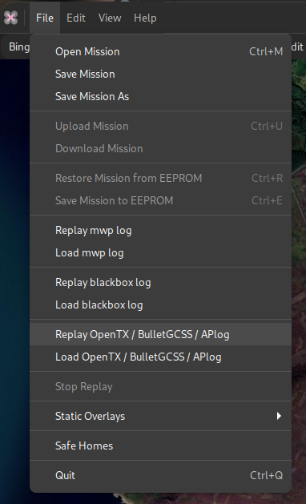

# Ardupilot log replay

## Requirements

Since mwptools 4.288.519 of 2021-10-16, it is possible to replay Ardupilot logs in the same way as one can replay blackbox, OpenTX/EdgeTX and BulletGCCS logs. This also requires [flightlog2x tools](https://github.com/stronnag/bbl2kml) of the same (0.11.0) or more recent vintage.

* It is necesasry to install an Ardupilot tool to decode the logs [mavlogdump.py](https://github.com/ArduPilot/pymavlink).

As the author does not have any (useful) AP logs, contributions are welcome.

